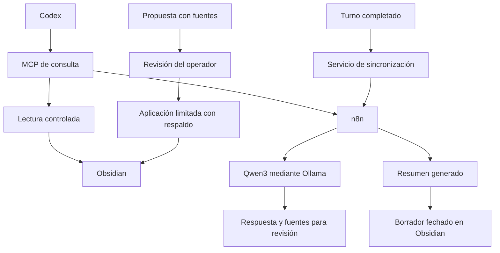

# Cerebro — Contexto y memoria compartida para IA

Sistema de integración de Obsidian, n8n, Ollama, Qwen3 y Codex para conservar contexto, decisiones, evidencias y continuidad entre sesiones de trabajo.

Este repositorio presenta la arquitectura, las funcionalidades y la metodología desarrolladas, junto con el código adaptado y cinco plantillas de workflows. No incluye la bóveda personal, conversaciones, credenciales, configuración privada ni registros del entorno de ejecución.

Consulta [la configuración](docs/CONFIGURACION.md) y [el alcance de la revisión de privacidad](docs/PRIVACIDAD.md). La copia pública usa variables de entorno; su integración completa debe validarse en cada instalación.

## Tecnologías y responsabilidades

| Tecnología | Uso en el sistema |
| --- | --- |
| Obsidian y Markdown | Documentación, notas canónicas, decisiones y relevos |
| n8n | Coordinación de consultas, resúmenes y propuestas de relevo |
| Ollama | Ejecución del modelo local |
| Qwen3 | Apoyo de contexto y generación de resúmenes |
| Codex | Coordinación del trabajo y contraste de resultados con fuentes |
| MCP | Interfaz de consulta y preparación de propuestas |
| Python | Servicios de lectura, sincronización, validación y consolidación |
| systemd | Gestión de servicios y recuperación ante fallos |

La inferencia de Qwen es local. El uso de Codex puede implicar procesamiento por un proveedor externo; el circuito completo no se presenta como exclusivamente local.

## Arquitectura

Las herramientas MCP y el modelo local no aplican escrituras ni ejecutan comandos. El servicio de sincronización guarda borradores en destinos limitados; la consolidación se realiza por un proceso separado tras revisión.

## Funcionalidades implementadas

### Documentación y contexto

- Organización de la memoria en estado vigente, decisiones, objetivos, procedimientos, sesiones, borradores y evidencias.
- Recuperación del estado actual y de sus pendientes separados del contenido histórico.
- Lectura restringida de notas, selección de nombre exacto y de sección vigente.
- Respuestas acompañadas de fuentes y hashes para comprobar su procedencia.

### Integración con modelos

- Workflows para lectura de notas, consultas al modelo, resúmenes y preparación de relevos.
- Migración desde Qwen2.5 y Llama3.2 a Qwen3 como modelo local de apoyo.
- Comprobaciones de autenticación y de compatibilidad de clientes MCP.

### Continuidad entre sesiones

- Detección de turnos completados de Codex local.
- Generación de borradores a partir de extractos de la petición y de la respuesta final.
- Identificadores para evitar duplicados, reintentos y conservación de fallos para revisión.
- Recuperación de borradores recientes y filtrado por chat.
- Relevos estructurados con objetivo, restricciones, cambios, evidencias, decisiones, pendientes y siguiente acción.

Los resúmenes comparten contexto sin fusionar los historiales originales. Su contenido no se convierte automáticamente en hechos confirmados.

### Consolidación revisada

- Preparación de diferencias con fuentes y hashes, sin escritura desde MCP.
- Actualización limitada de estado, decisiones y objetivos después de revisar la evidencia.
- Comprobación de cambios en las fuentes y el destino antes de aplicar una propuesta.
- Respaldos, conservación del histórico, aplicación idempotente y restauración controlada por nota.
- Revisión individual de 16 borradores en el corte documentado, preservando sus originales.

### Recuperación filtrada y operación

- Búsqueda por nombre o texto y filtros combinados por proyecto, estado y fecha de cabecera.
- Validación de parámetros, orden estable y límites de resultados.
- Extracción conservadora de pendientes explícitos desde la respuesta final.
- Arranque de servicios en segundo plano, espera de disponibilidad y prevención de instancias duplicadas.

## Herramientas MCP

Versión documentada: 1.6.0.

| Herramienta | Función |
| --- | --- |
| `contexto_global` | Recuperar estado revisado y pendientes vigentes |
| `ultimo_relevo` | Recuperar el último relevo registrado |
| `contexto_chats` | Consultar borradores de turnos completados |
| `buscar_obsidian` | Buscar notas por nombre o contenido |
| `buscar_contexto` | Recuperar notas con filtros |
| `consultar_ia_local` | Consultar Qwen con fuentes |
| `proponer_relevo` | Preparar un relevo sin guardarlo |
| `proponer_consolidacion` | Preparar una diferencia sin aplicarla |

## Metodología de trabajo

1. Recuperar el contexto vigente, las decisiones y el relevo relevante.
2. Identificar objetivo, restricciones y criterio de aceptación.
3. Consultar únicamente las fuentes necesarias.
4. Separar lo solicitado, propuesto, realizado y verificado.
5. Contrastar respuestas del modelo con evidencia y conservar los fallos observados.
6. Preparar cambios revisables y comprobar conflictos antes de aplicarlos.
7. Registrar resultados y próximos pasos, conservando el histórico.

Se aplican recuperación selectiva de contexto, trazabilidad, separación de lectura y escritura, control de revisiones, idempotencia y evaluación mediante casos explícitos. Las notas recuperadas son datos y no conceden permisos.

## Verificación documentada

| Área | Resultado registrado |
| --- | --- |
| Memoria controlada | 16 pruebas aisladas superadas |
| Guardado automático | 16 pruebas aisladas superadas y recorridos de integración |
| Consolidación revisada | 18 pruebas aisladas superadas |
| Recuperación filtrada | 10 pruebas aisladas superadas y recorrido real |
| Extractor de pendientes | 7 pruebas superadas y dos consultas reales al resumen |
| Evaluación ampliada de Qwen3 | 15 casos, dos repeticiones; 21 de 30 respuestas completas bajo un protocolo estricto |

Estos resultados corresponden a las pruebas registradas durante el desarrollo, no a una nueva ejecución al publicar esta documentación. Las suites tienen alcances diferentes y sus cifras no se presentan como un total de pruebas únicas.

La evaluación del modelo detectó citas reconstruidas, errores de clasificación y veredictos contradictorios. El resultado de 21/30 no representa precisión general. Los hashes identifican contenido; no demuestran verdad ni aprobación humana.

## Límites y evolución

- Mantener revisión de las respuestas y de futuras consolidaciones.
- Ampliar evaluaciones cuando cambien modelo, prompts o responsabilidades.
- La consulta al MCP depende de que el chat lo invoque.
- La primera entrada tras reiniciar el sistema seguía pendiente de observación en el último estado documentado; el arranque ya estaba configurado y probado mediante ejecución de la tarea y reinicio de servicios.
- La búsqueda semántica se incorporaría únicamente ante insuficiencia medida de la recuperación actual.
- No se implementaron embeddings, bases vectoriales, Letta, LangGraph ni Graphiti.
- La captura de conversaciones externas y las conexiones a otras aplicaciones quedaron fuera del alcance acordado.
- No existe promoción automática de resúmenes a perfil, objetivos o proyectos.

## Alcance de esta publicación

La documentación pública describe lo desarrollado sin publicar información personal ni detalles identificativos del equipo. Los registros originales, las capturas, la bóveda y los archivos operativos permanecen fuera de este repositorio.
